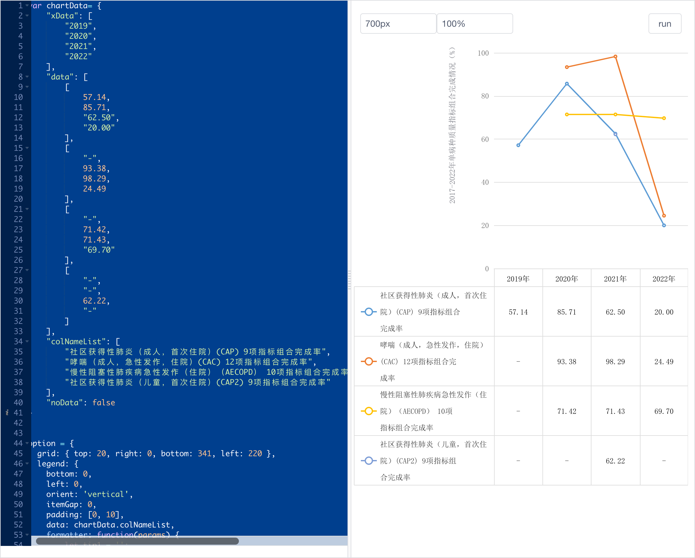
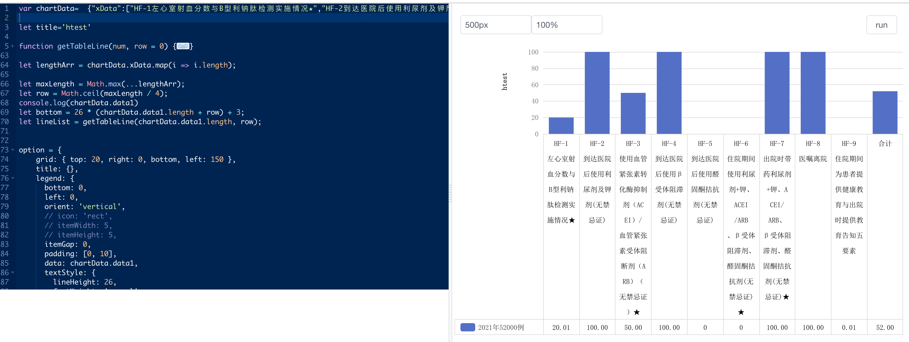

# 外部参数
params,mychart,echarts

## params 外部参数
从外部获取的参数内容,都存放在params,主要解决在部分图表编写时,需要外部数据的引用;
```js
console.log(params);
```
## mychart 图表对象本身

### 使用示例
```js
let url = myChart.getDataURL({
    type: "png",
    pixelRatio: window.devicePixelRatio,
    backgroundColor: "white",
    //  可以忽略图表内一些组件
    excludeComponents: ["dataZoom"]
})
let alink = document.createElement("a")
alink.href = url;
alink.download = 'htest.png'
alink.click();

option={ ... }

```

## echarts echart对象类

```js
import * as echarts from 'echarts'
```

### 使用示例
```json
console.log('==',params);
option = {
  color: ['#80FFA5', '#00DDFF', '#37A2FF', '#FF0087', '#FFBF00'],
  title: {
    text: 'Gradient Stacked Area Chart'
  },
  tooltip: {
    trigger: 'axis',
    axisPointer: {
      type: 'cross',
      label: {
        backgroundColor: '#6a7985'
      }
    }
  },
  legend: {
    data: ['Line 1', 'Line 2', 'Line 3', 'Line 4', 'Line 5']
  },
  toolbox: {
    feature: {
      saveAsImage: {}
    }
  },
  grid: {
    left: '3%',
    right: '4%',
    bottom: '3%',
    containLabel: true
  },
  xAxis: [
    {
      type: 'category',
      boundaryGap: false,
      data: ['Mon', 'Tue', 'Wed', 'Thu', 'Fri', 'Sat', 'Sun']
    }
  ],
  yAxis: [
    {
      type: 'value'
    }
  ],
  series: [
    {
      name: 'Line 1',
      type: 'line',
      stack: 'Total',
      smooth: true,
      lineStyle: {
        width: 0
      },
      showSymbol: false,
      areaStyle: {
        opacity: 0.8,
        color: new echarts.graphic.LinearGradient(0, 0, 0, 1, [
          {
            offset: 0,
            color: 'rgb(128, 255, 165)'
          },
          {
            offset: 1,
            color: 'rgb(1, 191, 236)'
          }
        ])
      },
      emphasis: {
        focus: 'series'
      },
      data: [140, 102, 141, 164, 90, 340, 250]
    },
    {
      name: 'Line 2',
      type: 'line',
      stack: 'Total',
      smooth: true,
      lineStyle: {
        width: 0
      },
      showSymbol: false,
      areaStyle: {
        opacity: 0.8,
        color: new echarts.graphic.LinearGradient(0, 0, 0, 1, [
          {
            offset: 0,
            color: 'rgb(0, 221, 255)'
          },
          {
            offset: 1,
            color: 'rgb(77, 119, 255)'
          }
        ])
      },
      emphasis: {
        focus: 'series'
      },
      data: [120, 282, 111, 234, 220, 340, 310]
    },
    {
      name: 'Line 3',
      type: 'line',
      stack: 'Total',
      smooth: true,
      lineStyle: {
        width: 0
      },
      showSymbol: false,
      areaStyle: {
        opacity: 0.8,
        color: new echarts.graphic.LinearGradient(0, 0, 0, 1, [
          {
            offset: 0,
            color: 'rgb(55, 162, 255)'
          },
          {
            offset: 1,
            color: 'rgb(116, 21, 219)'
          }
        ])
      },
      emphasis: {
        focus: 'series'
      },
      data: [320, 132, 201, 334, 190, 130, 220]
    },
    {
      name: 'Line 4',
      type: 'line',
      stack: 'Total',
      smooth: true,
      lineStyle: {
        width: 0
      },
      showSymbol: false,
      areaStyle: {
        opacity: 0.8,
        color: new echarts.graphic.LinearGradient(0, 0, 0, 1, [
          {
            offset: 0,
            color: 'rgb(255, 0, 135)'
          },
          {
            offset: 1,
            color: 'rgb(135, 0, 157)'
          }
        ])
      },
      emphasis: {
        focus: 'series'
      },
      data: [220, 402, 231, 134, 190, 230, 120]
    },
    {
      name: 'Line 5',
      type: 'line',
      stack: 'Total',
      smooth: true,
      lineStyle: {
        width: 0
      },
      showSymbol: false,
      label: {
        show: true,
        position: 'top'
      },
      areaStyle: {
        opacity: 0.8,
        color: new echarts.graphic.LinearGradient(0, 0, 0, 1, [
          {
            offset: 0,
            color: 'rgb(255, 191, 0)'
          },
          {
            offset: 1,
            color: 'rgb(224, 62, 76)'
          }
        ])
      },
      emphasis: {
        focus: 'series'
      },
      data: [220, 302, 181, 234, 210, 290, 150]
    }
  ]
};
```


### 国委 折线 表格图示例

```js
    var chartData= {
        "xData": [
            "2019",
            "2020",
            "2021",
            "2022"
        ],
        "data": [
            [
                57.14,
                85.71,
                "62.50",
                "20.00"
            ],
            [
                "-",
                93.38,
                98.29,
                24.49
            ],
            [
                "-",
                71.42,
                71.43,
                "69.70"
            ],
            [
                "-",
                "-",
                62.22,
                "-"
            ]
        ],
        "colNameList": [
            "社区获得性肺炎（成人，首次住院）(CAP) 9项指标组合完成率",
            "哮喘（成人，急性发作，住院）(CAC) 12项指标组合完成率",
            "慢性阻塞性肺疾病急性发作（住院）（AECOPD） 10项指标组合完成率",
            "社区获得性肺炎（儿童，首次住院）(CAP2) 9项指标组合完成率"
        ],
        "noData": false
    }


    option = {
    grid: { top: 20, right: 0, bottom: 341, left: 220 },
    legend: {
        bottom: 0,
        left: 0,
        orient: 'vertical',
        itemGap: 0,
        padding: [0, 10],
        data: chartData.colNameList,
        formatter: function(params) {
            let tip1 = '';
            let tip = '';
            let le = params.length; //图例文本的长度
            let max = 14;
            if (le > max) {
            //几个字换行大于几就可以了
            let l = Math.ceil(le / max); //有些不能整除，会有余数，向上取整
            for (let i = 1; i <= l; i++) {
                //循环
                if (i < l) {
                //最后一段字符不能有\n
                tip1 += params.slice(i * max - max, i * max) + '\n'; //字符串拼接
                } else if (i === l) {
                //最后一段字符不一定够9个
                tip = tip1 + params.slice((l - 1) * max, le); //最后的拼接在最后
                }
            }
            return tip;
            } else {
            tip = params; //前面定义了tip为空，这里要重新赋值，不然会替换为空
            return tip;
            }
        },
        textStyle: { lineHeight: 26, fontWeight: 'normal', fontFamily: 'SimSun' }
    },
    tooltip: { trigger: 'axis' },
    xAxis: {
        type: 'category',
        data: ['2019', '2020', '2021', '2022'],
        splitLine: { show: false },
        axisTick: { show: true, length: 344, lineStyle: { color: '#dddddd' } },
        axisLine: { lineStyle: { type: 'solid', color: '#dddddd' } },
        axisLabel: {
        margin: 3,
        interval: 0,
        formatter:function(value) {
            var indexNum = 0;
            for (var i = 0; i < chartData.xData.length; i++) {
                if (value === chartData.xData[i]) {
                indexNum = i;
                }
            }
            let str = '';
            chartData.data.forEach((i, index) => {
                str += '}\n{table' + Math.ceil(chartData.colNameList[index].length / 14) + '|' + i[indexNum];
            });
            return '{table|' + value + '年' + str + '}';
            },
        rich: {
            table: {
            lineHeight: 26,
            align: 'center',
            color: '#000000',
            fontFamily: 'SimSun'
            },
            table1: {
            lineHeight: 26,
            align: 'center',
            color: '#000000',
            fontFamily: 'SimSun'
            },
            table2: {
            lineHeight: 52,
            align: 'center',
            color: '#000000',
            fontFamily: 'SimSun'
            },
            table3: {
            lineHeight: 78,
            align: 'center',
            color: '#000000',
            fontFamily: 'SimSun'
            },
            table4: {
            lineHeight: 104,
            align: 'center',
            color: '#000000',
            fontFamily: 'SimSun'
            },
            table5: {
            lineHeight: 130,
            align: 'center',
            color: '#000000',
            fontFamily: 'SimSun'
            }
        }
        }
    },
    yAxis: [
        {
        type: 'value',
        name: '2017-2022年单病种质量指标组合完成情况（%）',
        nameRotate: 90,
        nameTextStyle: {
            verticalAlign: 'bottom',
            align: 'right',
            padding: [0, 0, 60, 0],
            fontFamily: 'SimSun'
        },
        splitLine: { show: true, lineStyle: { type: 'solid', color: '#ddd' } },
        axisLine: { show: false },
        axisTick: { show: false },
        axisLabel: { textStyle: { color: '#666', fontFamily: 'SimSun' } },
        min: 0,
        max: 100
        }
    ],
    series: [
        {
        type: 'line',
        name: '社区获得性肺炎（成人，首次住院）(CAP) 9项指标组合完成率',
        data: [57.14, 85.71, '62.50', '20.00']
        },
        {
        type: 'line',
        name: '哮喘（成人，急性发作，住院）(CAC) 12项指标组合完成率',
        data: ['-', 93.38, 98.29, 24.49]
        },
        {
        type: 'line',
        name: '慢性阻塞性肺疾病急性发作（住院）（AECOPD） 10项指标组合完成率',
        data: ['-', 71.42, 71.43, '69.70']
        },
        {
        type: 'line',
        name: '社区获得性肺炎（儿童，首次住院）(CAP2) 9项指标组合完成率',
        data: ['-', '-', 62.22, '-']
        }
    ],
    graphic: [
        {
        type: 'line',
        bottom: 312,
        right: 0,
        left: 0,
        style: { fill: '#dddddd', stroke: '#dddddd' },
        shape: { x1: 10, y1: 0, x2: 100000, y2: 0 }
        },
        {
        type: 'line',
        bottom: 0,
        right: 0,
        left: 0,
        style: { fill: '#dddddd', stroke: '#dddddd' },
        shape: { x1: 10, y1: 0, x2: 100000, y2: 0 }
        },
        {
        type: 'line',
        bottom: 78,
        right: 0,
        left: 0,
        style: { fill: '#dddddd', stroke: '#dddddd' },
        shape: { x1: 10, y1: 0, x2: 100000, y2: 0 }
        },
        {
        type: 'line',
        bottom: 156,
        right: 0,
        left: 0,
        style: { fill: '#dddddd', stroke: '#dddddd' },
        shape: { x1: 10, y1: 0, x2: 100000, y2: 0 }
        },
        {
        type: 'line',
        bottom: 234,
        right: 0,
        left: 0,
        style: { fill: '#dddddd', stroke: '#dddddd' },
        shape: { x1: 10, y1: 0, x2: 100000, y2: 0 }
        },
        {
        type: 'line',
        bottom: 0,
        left: 0,
        style: { fill: '#dddddd', stroke: '#dddddd' },
        shape: { x1: 0, y1: 26, x2: 0, y2: 338 }
        },
        {
        type: 'line',
        bottom: 0,
        right: 0,
        style: { fill: '#dddddd', stroke: '#dddddd' },
        shape: { x1: 0, y1: 0, x2: 0, y2: 341 }
        }
    ],
    color: [
        '#5b9bd5',
        '#ed7d31',
        '#ffc000',
        '#7d9dd6',
        '#70ad47',
        '#255e91',
        '#9e480e',
        '#636363',
        '#997300',
        '#264478',
        '#43682b',
        '#7cafdd',
        '#f1975a',
        '#b7b7b7',
        '#ffcd33',
        '#698ed0',
        '#8dc169'
    ]
    }

```
### 国委 柱状 表格图示例


```js
//var chartData=  {"xData":["HF-1左心室射血分数与B型利钠肽检测实施情况★","HF-2到达医院后使用利尿剂及钾剂(无禁忌证)","HF-3使用血管紧张素转化酶抑制剂（ACEI）/血管紧张素受体阻断剂（ARB）（无禁忌证）★","HF-4到达医院后使用β受体阻滞剂(无禁忌证)","HF-5到达医院后使用醛固酮拮抗剂(无禁忌证)","HF-6住院期间使用利尿剂+钾、ACEI/ARB、β受体阻滞剂、醛固酮拮抗剂(无禁忌证)★","HF-7出院时带药利尿剂+钾、ACEI/ARB、β受体阻滞剂、醛固酮拮抗剂(无禁忌证)★","HF-8医嘱离院","HF-9住院期间为患者提供健康教育与出院时提供教育告知五要素","合计"],"data":[[20.01,"100.00","50.00","100.00",0,0,"100.00","100.00",0.01,"52.00"]],"data1":["2021年52000例"],"noData":false}
// var chartData={"xData":["CABG-1术前评估(四项)","CABG-2手术适应证与急症手术指征","CABG-3首根血管桥材料选择为“左乳房内动脉\"","CABG-4围术期预防性抗菌药物使用情况","CABG-5术后应用抗血小板药物情况","CABG-6术后无活动性出血、血肿，再手术情况★","CABG-7术后无并发症★","CABG-8出院时阿司匹林、β受体阻滞剂、他汀类药物使用情况★","CABG-9住院期间为患者提供术前、术后健康教育与出院时提供教育告知五要素情况","CABG-10手术切口愈合情况","CABG-11医嘱离院","合计"],"data":[[0,"100.00",45.83,10.42,79.17,70.83,"100.00",79.17,68.75,89.58,"100.00",67.61],[3.16,"100.00",69.77,32.72,65.81,96.94,96.39,57.94,52.41,98.63,98.44,70.23],[9.14,"100.00",75.29,12.66,"87.70",98.04,97.03,72.69,55.18,97.52,96.88,72.94],[0,"100.00","100.00","100.00",0,"100.00","100.00",0,0,"100.00","100.00",63.64]],"data1":["2019年48例","2020年26077例","2021年15826例","2022年7例"],"noData":false}
var chartData={"xData":["MVR-1术前评估★","MVR-2手术明示适应证★","MVR-3术中使用TEE超声验证二尖瓣置换术效果的措施★","MVR-4预防抗菌药物应用合规★","MVR-5术后无活动性出血或血肿与再手术情况★","MVR-6术后无并发症★","MVR-7出院时华法林使用★","MVR-8住院期间为患者提供术前、术后健康教育与出院时提供教育告知五要素","MVR-9手术切口甲级愈合","MVR-10医嘱离院","合计"],"data":[[0,"100.00",0,0,"100.00",0,0,0,0,0,23.08],["100.00","100.00","100.00","100.00",0,0,"100.00","100.00","100.00",0,"70.00"],[0,"100.00",0,"100.00","100.00","100.00",0,0,"100.00","100.00",62.07]],"data1":["2020年51986例","2021年7例","2022年7例"],"noData":false}


let title='htest'

function getTableLine(num, row = 0) {
  const list = [];
  const bottom = 26 * num; // 控制线的位置
  const height = 26;
  for (var i = 0; i <= num; i++) {
    list.push({
      type: 'line',
      bottom: bottom - i * height,
      right: 0,
      left: 0,
      style: {
        fill: '#dddddd',
        stroke: '#dddddd',
      },
      shape: {
        x1: 10,
        y1: 0,
        x2: 100000,
        y2: 0,
      },
    });
  }
  list.push(
    {
      type: 'line',
      bottom: 0,
      left: 0,
      style: {
        fill: '#dddddd',
        stroke: '#dddddd',
      },
      shape: {
        // 几条线
        x1: 0,
        y1: 26,
        x2: 0,
        y2: 26 * num + 26,
      },
    },
    {
      type: 'line',
      bottom: 0,
      right: 0,
      style: {
        fill: '#dddddd',
        stroke: '#dddddd',
      },
      shape: {
        // 几条线
        x1: 0,
        y1: 0,
        x2: 0,
        y2: 26 * (num + (row ? row - 1 : 0)) + 29,
      },
    }
  );
  return list;
}

let lengthArr = chartData.xData.map(i => i.length);
 
let maxLength = Math.max(...lengthArr);
let row = Math.ceil(maxLength / 4);
// console.log(chartData.data1)
let bottom = 26 * (chartData.data1.length + row) + 3;
let lineList = getTableLine(chartData.data1.length, row);
  
  
option = {
    grid: { top: 20, right: 0, bottom, left: 150 },
    title: {},
    legend: {
      bottom: 0,
      left: 0,
      orient: 'vertical',
      // icon: 'rect',
      // itemWidth: 5,
      // itemHeight: 5,
      itemGap: 0,
      padding: [0, 10],
      data: chartData.data1,
      textStyle: {
        lineHeight: 26,
        fontWeight: 'normal',
        fontFamily: 'SimSun',
      },
    },
    tooltip: {
      trigger: 'axis',
    },
    xAxis: {
      type: 'category',
      data: chartData.xData,
      splitLine: {
        show: false,
      },
      axisTick: {
        show: true,
        length: 26 * (chartData.data1.length + row) + 32, // 竖线的长度
        lineStyle: {
          color: '#dddddd',
        },
      },
      axisLine: {
        lineStyle: {
          type: 'solid',
          color: '#dddddd',
        },
      },
      axisLabel: {
        margin: 3,
        interval: 0,
        formatter: function(value) {
          var indexNum = 0;
          for (var i = 0; i < chartData.xData.length; i++) {
            if (value === chartData.xData[i]) {
              indexNum = i;
            }
          }
          let str = '';
          chartData.data.forEach(i => {
            str += '}\n{table|' + i[indexNum];
          });
          let newParamsName = '';
          let paramsNameNumber = value.length;
          let provideNumber = 4; // 一行显示几个字 然后就超过字数就会自动换行
          // if (paramsNameNumber > provideNumber) {
          for (let p = 0; p < row; p++) {
            let tempStr = '';
            let start = p * provideNumber;
            let end = start + provideNumber;
            if (p == row - 1) {
              tempStr = value.substring(start, paramsNameNumber);
            } else {
              tempStr = value.substring(start, end) + '\n';
            }
            newParamsName += tempStr;
          }

          // } else {
          //   newParamsName = value + '\n';
          // }
          return '{tableH|' + newParamsName + '}{table|' + str + '}\n{table|' + '}';
        },
        rich: {
          tableH: {
            height: 26 * row + 3,
            lineHeight: 26,
            align: 'center',
            color: '#000000',
            fontFamily: 'SimSun',
          },
          table: {
            lineHeight: 26,
            align: 'center',
            color: '#000000',
            fontFamily: 'SimSun',
          },
        },
      },
    },
    yAxis: [
      {
        type: 'value',
        name: title,
        nameRotate: 90,
        nameTextStyle: {
          verticalAlign: 'bottom',
          align: 'right',
          padding: [0, 50, 60, 0],
          color: '#333333',
          fontWeight: 'bold',
          fontFamily: 'SimSun',
        },
        splitLine: {
          show: true,
          lineStyle: {
            type: 'solid',
            color: '#ddd',
          },
        },
        axisLine: {
          show: false,
        },
        axisTick: {
          show: false,
        },
        axisLabel: {
          textStyle: {
            color: '#666',
            fontFamily: 'SimSun',
          },
        },
        min: 0,
        max: 100,
      },
    ],
    series: chartData.data.map((i, index) => ({
      type: 'bar',
      name: chartData.data1[index],
      data: i,
    })),
    graphic: lineList,
  }
  
  //console.log('h',option)


```


